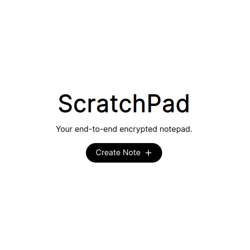

# Scratchpad

<kbd>
  
</kbd>

This is a simple fully offline notes application built with Svelte and using browser storage. pocketbase for online data storage.

## Features

- Create, read, update, and delete notes.
- A crude and probably incorrect implementation of encypting notes.
- Easy to use interface built with Svelte.
- Data can either be stored in-browser or synced using self-hosted pocketbase.

## Installation

1. Clone the repository:
```bash
git clone https://github.com/Shubhamai/Scratchpad
```
2. Navigate into the project directory:
```bash
cd Scratchpad
```
3. Install the dependencies:
```bash
bun i
```
4. Start the application:
```bash
bun dev
```

## License

This project is licensed under the MIT License. See the [LICENSE](LICENSE.md) file for details.
